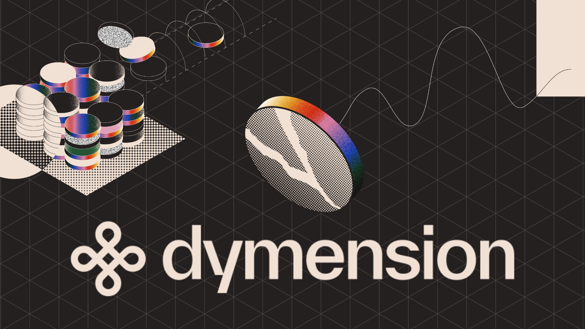

# Dymension Hub




## Overview

Welcome to the Dymension Hub, the **Settlement Layer of the Dymension protocol**.

This guide will walk you through the steps required to set up and run a Dymension Hub full node.

## Table of Contents

- [Dymension Hub](#dymension-hub)
  - [Overview](#overview)
  - [Table of Contents](#table-of-contents)
  - [Prerequisites](#prerequisites)
  - [Installation](#installation)
  - [Initializing `dymd`](#initializing-dymd)
  - [Running the Chain](#running-the-chain)
  - [Bootstrapping liquidity pools](#bootstrapping-liquidity-pools)
  - [Debugging Dymension container with Devel](#debugging-dymension-container-with-devel)
  - [Adding incentives](#adding-incentives)
    - [Creating incentives streams](#creating-incentives-streams)
    - [Locking tokens](#locking-tokens)
    - [check rewards](#check-rewards)

## Prerequisites

- [Go (v1.18 or above)](https://go.dev/doc/install)

## Installation

Clone `dymension`:

```sh
git clone https://github.com/dymensionxyz/dymension.git
cd dymension
make install
```

Check that the dymd binaries have been successfully installed:

```sh
dymd version
```

If the dymd command is not found an error message is returned,
confirm that your [GOPATH](https://go.dev/doc/gopath_code#GOPATH) is correctly configured by running the following command:

```sh
export PATH=$PATH:$(go env GOPATH)/bin
```

## Initializing `dymd`

- Using the setup script:

  This method is preferred as it preconfigured to support [running rollapps locally](https://github.com/dymensionxyz/roller)

  ```sh
  bash scripts/setup_local.sh
  ```

- Manually:

  First, set the following environment variables:

  ```sh
  export CHAIN_ID="dymension_100-1"
  export KEY_NAME="local-user"
  export MONIKER_NAME="local"
  ```

  Second, create genesis and init dymension chain:

  ```sh
  dymd init "$MONIKER_NAME" --chain-id "$CHAIN_ID"
  ```

  Third, set parameters to ensure denom is udym:

  ```sh
  bash scripts/set_params.sh
  ```

  Then, add genesis account and provide token to the account:

  ```sh
  dymd keys add "$KEY_NAME" --keyring-backend test
  dymd add-genesis-account "$(dymd keys show "$KEY_NAME" -a --keyring-backend test)" 1000dym
  dymd gentx "$KEY_NAME" 670dym --chain-id "$CHAIN_ID" --keyring-backend test
  dymd collect-gentxs
  ```

## Running the Chain

Now start the chain!

```sh
dymd start
```

You should have a running local node!

## Bootstrapping liquidity pools

To bootstrap the `GAMM` module with pools:

```sh
sh scripts/pools/pools_bootstrap.sh
```

## Adding incentives

### Creating incentives streams

After creating the pools above, we create 2 incentive streams through gov:

```sh
sh scripts/incentives/fund_incentives.sh
```

Wait for the gov proposal to pass, and validate with:

```sh
dymd q streamer streams
```

### Locking tokens

To get incentives, we need to lock the LP tokens:

```sh
sh scripts/incentives/lockup_bootstrap.sh
```

validate with:

```sh
dymd q lockup module-balance
```

### check rewards

Every minute a share of the rewards will be distributed!

validate with:

```sh
dymd q incentives active-gauges

# alternatively, watch the outpup - you will see the "amount" change every minute
#  watch -n1 -d "dymd q incentives active-gauges --output json | jq '.data[] | { "id": .id, "coins": .coins } '"
```

## Debugging Container

Pre-requisite:
 Install [Docker](https://docs.docker.com/get-docker/)
 Install [VSCode](https://code.visualstudio.com/)
 Install [VSCode Go extension](https://marketplace.visualstudio.com/items?itemName=golang.go)
 Install [Devel](https://github.com/go-delve/delve)

To debug, you can use the the following command to run the debug container:

```sh
make docker-run-debug
```

Then you can run the debugger with the following config for `launch.json` in VSCode:

```json
{
    "version": "0.2.0",
    "configurations": [
        {
            "name": "Dymension Debug Container",
            "type": "go",
            "request": "attach",
            "mode": "remote",
            "port": 4000,
            "host": "127.0.0.1",
            "debugAdapter": "legacy" // To be remove in the future after https://github.com/golang/vscode-go/issues/3096 is fixed
        }
    ]
}
```

After that, you can run the debugger and set breakpoints in the code.

Example: 

Add breakpoint to `ctx` in `x/eibc/keeper/grpc_query.go` :

```go
func (q Querier) Params(goCtx context.Context, req *types.QueryParamsRequest) (*types.QueryParamsResponse, error) {
	if req == nil {
		return nil, status.Error(codes.InvalidArgument, "invalid request")
	}
	ctx := sdk.UnwrapSDKContext(goCtx)

	return &types.QueryParamsResponse{Params: q.GetParams(ctx)}, nil
}
```

Open your browser and go to `http://localhost:1318/dymensionxyz/dymension/eibc/params` and you will see debugger stop and print the value at the breakpoint.

---

For support, join our [Discord](http://discord.gg/dymension) community and find us in the Developer section.
